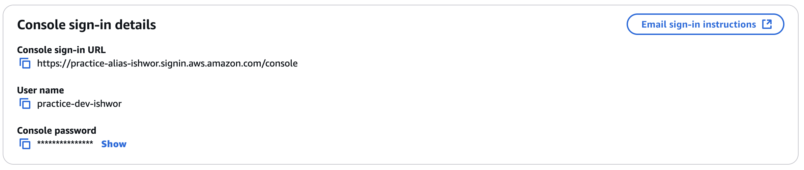

**Cloud Security with AWS IAM**

**Introduction**

AWS Identity and Access Management (IAM) is a crucial service for
managing access to AWS resources. It enables users to be grouped into
specific user groups, each with defined policies determining their
permissions. This ensures proper access control and security.

**Project Overview**

In this project, AWS IAM was utilized to create a custom policy that
regulates access to specific instances based on predefined rules. The
project involved setting up an IAM policy to grant or restrict
permissions accordingly.

The project first started by creating multiple EC2 instances, one is for
development and the other one is for production.

**Tags**

Tags are labels to help AWS account users identify and manage their
resources. Tags are useful for grouping, mass management, and applying
security policies.

In this project, tags were applied to instances for classification:

-   Environment (Env): Assigned values such as 'production' and
    'development' to distinguish the environment of each EC2 instance.

<figure>

<figcaption>

Figure 1: Name and Tags used while creating EC2 instance

</figcaption>
</figure>

**IAM Policies**

IAM policies define permissions for users and resources within an AWS
account. The policy created for this project:

-   Allowed full EC2-related actions on instances with the
    \"development\" environment tag.

-   Denied tag creation and deletion for all EC2 instances.

**Key Policy Components**:

-   **Effect:** Specifies whether actions are \"Allow\" or \"Deny.\"

-   **Action:** Defines the permitted or restricted AWS operations.

-   **Resource:** Specifies which AWS resources the policy applies to.

<figure>

<figcaption>

Figure 2: JSON Policy used in the project

</figcaption>
</figure>

**Account Alias**

An account alias provides a user-friendly name in place of the AWS
account ID for login.

Creating the alias took less than a minute, and the new AWS console
sign-in URL was generated accordingly. My URL was
<https://practice-alias-ishwor.signin.aws.amazon.com/console>.

<figure>

<figcaption>

Figure 3: Alias for the account

</figcaption>
</figure>

**IAM** **Users and User Groups**

-   **IAM Users:** Individual user accounts with specific permissions
    for accessing AWS resources. These users are created by myself by
    using AWS IAM service.

-   **User Groups:** A collection of users that share common policies.
    The custom policy was attached to a user group, ensuring all members
    inherited the assigned permissions.

**Logging in as an IAM User** IAM users can log in via:

1.  Receiving emailed sign-in instructions.

2.  Downloading a .csv file with login credentials.

<figure>

<figcaption>

Figure 4: Console Sign-in details

</figcaption>
</figure>

Once I logged in as an IAM user, I noticed a lot of panels had a display
saying "Access Denied". This was a clear difference from the dashboard I
saw in my AWS account (which has unrestricted access to the resources).

<figure>

<figcaption>

Figure 5: IAM user dashboard

</figcaption>
</figure>

**Testing IAM Policies**

I tested my IAM policies by trying to stop both EC2 instances, i.e.
development and production instances.

1.  **Stopping the production instance:** An error message appeared,
    indicating a lack of authorization due to policy restrictions.
    <figure>

<figcaption>

Figure 6: When trying to stop Production instance

</figcaption>
</figure>

2.  **Stopping the development instance:** The instance stopped
    successfully, as the policy allowed actions on resources tagged as
    \"development.\"
<figure>

<figcaption>

Figure 7: When trying to stop Development instance

</figcaption>
</figure>

**Conclusion**

This project demonstrated the effective use of AWS IAM for managing
access control. By implementing IAM policies and user groups, security
and resource organization were enhanced within the AWS environment.
<figure>

<figcaption>

Figure 8: Mapping User Permissions to Development and Production Environments

</figcaption>
</figure>
